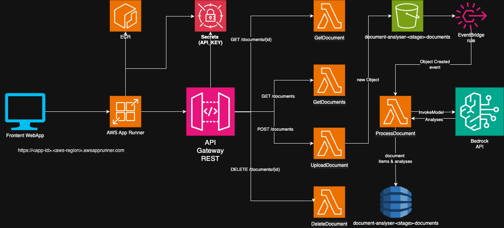

# Smart Document Analysing System

A serverless application that processes PDF, TXT or JSON documents using Lambda & API Gateway, EventBridge, S3 storage, DynamoDB and Amazon Bedrock API to infer the analyses of the uploaded documents. The application is deployed using AWS SAM.

## Architecture



The application architecture consists of several AWS services working together to provide a scalable and serverless document processing solution:

### API Layer
- **API Gateway** serves as the entry point, providing a RESTful API with the following endpoints:
  - POST /documents - Upload new documents
  - GET /documents - List all documents
  - GET /documents/{id} - Get specific document details
  - DELETE /documents/{id} - Delete a document
- API authentication is implemented using API keys with usage plans:
  - The API key is stored in Secrets Manager
  - Rate limit: 100 requests/second
  - Burst limit: 50 requests
  - Monthly quota: 10,000 requests

### Storage Layer
- **S3 Bucket** (`document-analyser-{stage}-documents`):
  - Stores the uploaded documents
  - Configured with EventBridge notifications for object creation events

- **DynamoDB Table** (`document-analyser-{stage}-documents`):
  - Stores document metadata and processing results
  - Uses document ID as partition key
  - Pay-per-request billing mode for cost optimization

### Processing Layer
Five Lambda functions handle different aspects of the application:

1. **UploadDocumentFunction** (`src/handlers/upload.js`):
   - Handles document uploads via API Gateway
   - Stores files in S3
   - Creates initial metadata in DynamoDB
   - Supports JSON, TXT, and PDF documents

2. **ProcessDocumentFunction** (`src/handlers/process.js`):
   - Triggered by EventBridge when new files are uploaded to S3
   - Extracts text from different document types
   - Integrates with Amazon Bedrock (Claude v2) for document analysis
   - Updates DynamoDB with processing results

3. **GetDocumentsFunction** (`src/handlers/list.js`):
   - Lists all documents from DynamoDB
   - Returns metadata and analysis results

4. **GetDocumentFunction** (`src/handlers/get.js`):
   - Retrieves specific document details
   - Combines metadata from DynamoDB with content from S3

5. **DeleteDocumentFunction** (`src/handlers/delete.js`):
   - Removes documents from both S3 and DynamoDB
   - Ensures cleanup of all associated resources

### Event Processing
- **EventBridge Rule** automatically triggers document processing:
  - Monitors S3 bucket for object creation events
  - Invokes ProcessDocumentFunction asynchronously
  - Enables serverless event-driven processing

### Frontend/App Runner Service
- **AWS App Runner** hosts the containerized web application:
  - Manages container deployment and updates
  - Provides HTTPS endpoint for secure access
  - Auto-restarts unhealthy containers

- **Amazon ECR** stores the frontend container image:
  - Repository name: `document-analyser-{stage}-webapp`
  - Automatic image scanning on push
  - Image tag mutability enabled

- **Frontend Application**:
  - Express.js web server serving static content
  - Modern UI with auto-refresh capabilities
  - Secure API key management through Secrets Manager
  - CORS-enabled communication with API Gateway
  - File upload support for multiple document types (.txt, .pdf, .json)

### Security
- Each Lambda function has specific IAM roles with least-privilege permissions
- S3 bucket policies control access to documents
- API Gateway usage plans manage and throttle API access
- Environment variables used for configuration
- Cross-Origin Resource Sharing (CORS) configured for web client access

### Scalability
- Serverless architecture allows automatic scaling
- DynamoDB auto-scaling with pay-per-request mode
- Lambda concurrency handles multiple simultaneous requests
- API Gateway throttling prevents overload

## Prerequisites

- Node.js 22.x
- AWS SAM CLI (installed globally)
- AWS CLI configured with appropriate credentials
- Docker Application 
- Amazon Bedrock with Claude v2 model enabled in your deployment region
  - Go to the Amazon Bedrock console
  - Navigate to "Model access"
  - Request access to the "Anthropic Claude v2" model
  - Wait for approval (usually immediate)
  - Ensure the model is enabled in your deployment region

## Installation

1. Install AWS SAM CLI:
```bash
# macOS
brew install aws-sam-cli

# Windows
choco install aws-sam-cli

# Linux
pip install aws-sam-cli
```

2. Install Docker 

```bash
# macOS
# Download Docker Desktop for Mac from https://www.docker.com/products/docker-desktop
# Or install via Homebrew:
brew install --cask docker

# Windows
# Download Docker Desktop for Windows from https://www.docker.com/products/docker-desktop
# Or install via Chocolatey:
choco install docker-desktop

# Linux (Ubuntu/Debian)
# Install using the convenience script
curl -fsSL https://get.docker.com -o get-docker.sh
sudo sh get-docker.sh

# Verify Docker installation
docker --version
docker run hello-world
```

After installation:
- Start Docker Desktop (on macOS and Windows)
- Verify Docker is running:
```bash
docker ps
```

3. Install project dependencies:
```bash
npm install
```

4. Verify installations:
```bash
# Check SAM CLI
sam --version

# Check Node.js
node --version
```

## Deployment

1. First-time deployment:

1.1. Prior to SAM application deployment run the following script to create an ECR Repository for the Frontend WebApp container image and push the image to the freshly created repository. This container image will be referenced and used by the Frontend Webapp application deployed in the next step using SAM.

```bash
# First, verify that your aws active credentials/profile are the expected ones
aws sts get-caller-identity
# Create the ECR repository and push the Docker image
cd webapp-frontend
chmod +x *.sh
./push-webapp-image-to-ecr.sh
```

1.2 Deploy the backend SAM application 

```bash
cd ..
sam build
sam deploy --guided
```
This will:
- Ask for configuration details
- Create a CloudFormation stack
- Deploy all resources
- Save the configuration to `samconfig.toml`

2. Subsequent deployments:
```bash
sam build
sam deploy
```

## API Gateway Resources

- POST /documents - Upload a new document
- GET /documents - List all documents
- GET /documents/{id} - Get document details
- DELETE /documents/{id} - Delete a document

## Document Types

The system supports the following document types:
- JSON documents
- Text documents
- PDF documents (base64 encoded)

## Testing the Application

For testing purposes, an App Runner hosted WebApp Frontend application was created as part of the SAM deployment. This is an Express web application defined under the `/webapp-frontend` directory. Before accesing the test webapp frontend, you'll need to:

1. **Get the Webapp Service URL from SAM deployment output**:
   
   Example output:
   ```bash
   Key              WebappServiceUrl
   Description      URL of the App Runner webapp service                                                                                                      
   Value            https://<app.id>.<aws-region>.awsapprunner.com/ 
   ```


2. **Open a Browser and navigate to the Webapp Service URL**
   - On the webapp, click the "Choose File" button and chose a file from the `test/sample_documents` directory in your project
   - You'll find sample files: `sample1.json`, `sample2.pdf`, and `sample3.txt`. 
   *Note* If you want to load your own file please make sure its size is less than 100KB. Because this is only a sample application and not one that facilitates large files processing mainly to avoid incurring high costs please consider file size limitation
   - Select one of the sample files (e.g., `sample1.json`)
   - Click "Upload Document" and wait for the upload success notification
   - Wait a 3-4 seconds then click the Refresh button to refresh the documents table content
   - The documents table will otherwise auto-refresh every 30 seconds and show the document analysis result
   - Once the processing is complete, you'll see the analysis results in the table

## Monitoring

As you perform tests with the WebApp Frontend you can inspect the application logs in CloudWatch for the following Lambda functions. Set the LOG_LEVEL environment variable appropriately to: debug, verbose, info (default), warn or error.

- UploadDocumentFunction
- ProcessDocumentFunction
- GetDocumentsFunction
- GetDocumentFunction
- DeleteDocumentFunction


Additional resources to monitor:
- File objects in the **document-analyser-dev-documents** S3 bucket
- Items in the **document-analyser-dev-documents** DynamoDB table

## Cleanup

1. Delete the ECR Repository of the WebApp container image and the documents S3 bucket

*Note* 
Because, when using SAM (or CloudFormation) there is no straight forward way to delete non-empty ECR repositories and S3 buckets, we need to first run an additional script with aws cli commands to delete & empty the ECR repository used by this application and also to empty the documents S3 bucket of this application. Once the S3 bucket is deleted the sam delete command will then be able to delete the empty bucket along with all the rest of the application constructs and services.

```bash 
cd webapp-frontend
./delete-webapp-ecr-and-s3.sh
```

2. Delete the sam application

To delete the stack and all the remaining resources:
```bash
cd ..
sam delete
```

## Project Structure

```
lambda-hack/
├── docs/
│   └── document-analyser-architecture.png
├── src/
│   ├── handlers/
│   │   ├── delete.js       # Lambda handler for deleting documents
│   │   ├── get.js          # Lambda handler for retrieving documents
│   │   ├── list.js         # Lambda handler for listing documents
│   │   ├── process.js      # Lambda handler for processing documents
│   │   └── upload.js       # Lambda handler for uploading documents
│   └── utils/
│       └── logger.js       # Centralized logging configuration
├── test/
│   └── sample_documents/   # Test documents for development
│       ├── sample1.json
│       ├── sample2.pdf
│       └── sample3.txt
├── webapp-frontend/        # Web application frontend
│   ├── public/
│   │   ├── css/
│   │   │   └── styles.css
│   │   ├── js/
│   │   │   └── app.js
│   │   └── index.html
│   ├── Dockerfile         # Container definition for the webapp
│   ├── .dockerignore
│   ├── package.json
│   ├── package-lock.json
│   ├── push-webapp-image-to-ecr.sh    # Script to create the ECR repo for the frontend app container
│   ├── delete-webapp-ecr-and-s3.sh    # Script to clean up ECR and S3 resources
│   ├── README.md
│   └── server.js                      # The Express application entry point file for the webapp frontend 
├── package.json
├── package-lock.json
├── README.md
└── template.yaml          # SAM template defining the application's AWS resources
```

### Key Components

1. **API Layer** (`src/handlers/`)
   - RESTful API endpoints implemented as Lambda functions
   - Handlers for CRUD operations on documents

2. **Utilities** (`src/utils/`)
   - Shared utilities and helper functions
   - Centralized logging configuration

3. **Web Application** (`webapp-frontend/`)
   - Express.js based web application
   - Containerized using Docker
   - Deployed to AWS App Runner

4. **Infrastructure** (root `/` directory)
   - SAM template for AWS resource definitions
   - Scripts for resource management and deployment
   - Environment configuration

5. **Documentation** (`docs/`)
   - Architecture diagrams
   - Technical documentation

6. **Testing** (`test/`)
   - Sample documents for testing
   - Test configurations and data
